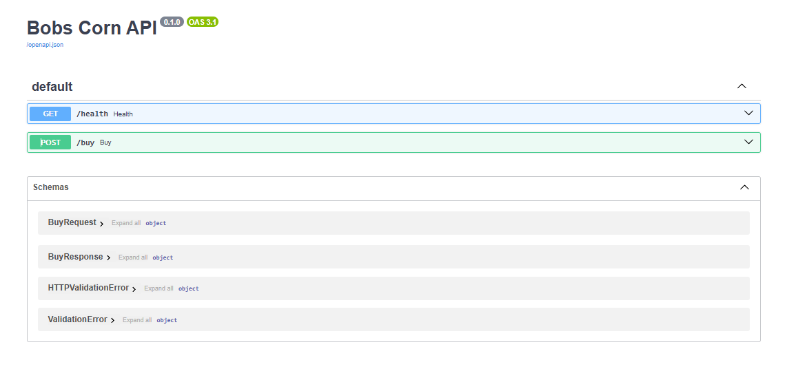

# Bobs Corn API (FastAPI)
  

## Run (dev)
```bash
cd server
python -m venv .venv
# Windows PowerShell:
.\.venv\Scripts\Activate.ps1
pip install -e ".[dev]"
uvicorn bobscorn.main:app --reload
````

## Run (Docker)

From repo root:

```bash
docker compose up --build
```

API will be available at:

* [http://127.0.0.1:8000](http://127.0.0.1:8000)

## Run multiple API instances (Docker)

This is useful to validate horizontal scaling (rate limiting backed by Redis).

From repo root:

```bash
docker compose up --build --scale api=3
```

Notes:

* If you add a load balancer later, it can distribute traffic across replicas.
* With Redis-backed rate limiting, limits are shared across replicas.

## URLs

* Swagger: [http://127.0.0.1:8000/docs](http://127.0.0.1:8000/docs)
* Health:  [http://127.0.0.1:8000/health](http://127.0.0.1:8000/health)

## Notes

* CORS is enabled for: [http://localhost:5173](http://localhost:5173)
* Rate limiting is enabled (per-client). If you hit 429, wait and retry.