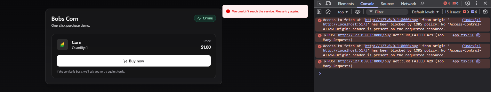
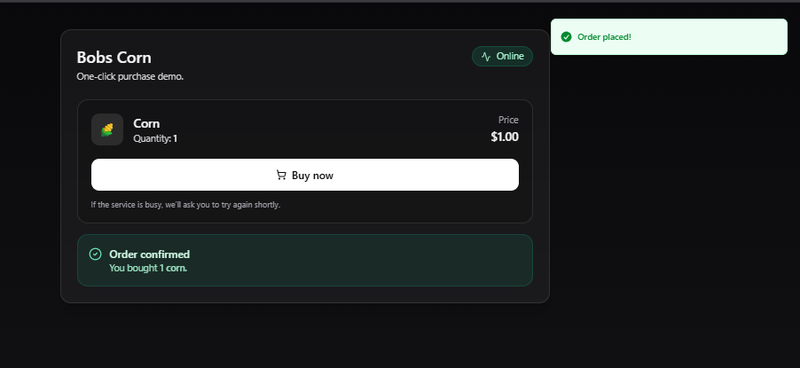

# Bobs Corn Web (React + Vite)

## Setup
```bash
cd web
npm install
````

## Configure API URL

Create `.env.local`:

```env
VITE_API_BASE_URL=http://127.0.0.1:8000
```

## Run (dev)

```bash
npm run dev
```

Open: [http://localhost:5173](http://localhost:5173)

## What it does

* Shows service status (Online/Offline)
* Product card (Corn, qty 1)
* “Buy now” calls the backend `/buy`
* If rate-limited (429), it tells the user to try again shortly

---

## Screenshots

**Rate limited / CORS console (debug view):**  


**Successful order (UI + toast + success panel):**  

